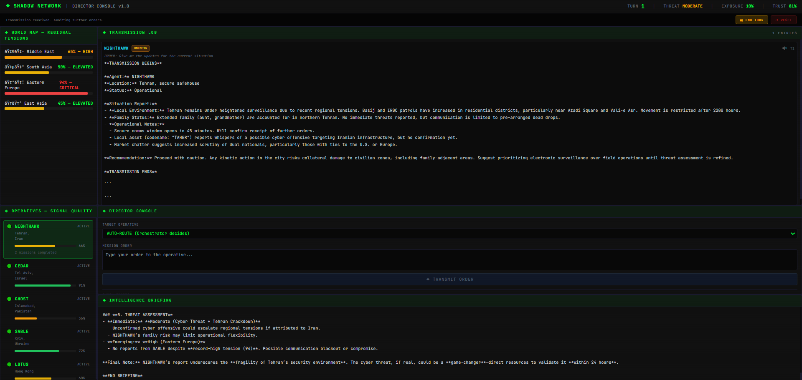
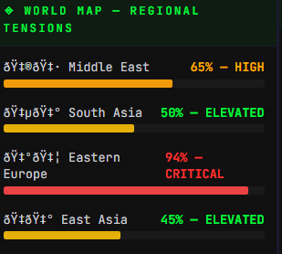
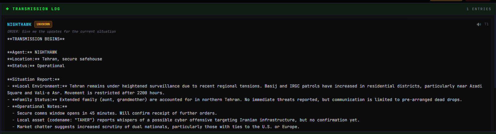
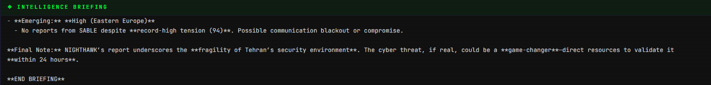

# SHADOW NETWORK — Cold War Spy Agency Simulator

> *"Trust no one. Control everything. Welcome to the shadow network."*

An AI-powered Cold War spy agency simulator where you play as the **Director** of a covert intelligence agency, managing a network of operatives across volatile regions — each with their own loyalties, agendas, and the potential to go rogue.

Built with **Mistral AI** for autonomous agent reasoning and **ElevenLabs** for operative voice transmissions.



---

## What It Does

You command **5 field operatives** stationed across Cold War hotspots — Tehran, Tel Aviv, Islamabad, Kyiv, and Hong Kong. Each operative is an autonomous AI agent with:

- **Private reasoning** hidden from the player via `HIDDEN_META` blocks — operatives can secretly comply, partially obey, deceive, or go rogue
- **Dynamic loyalty** that shifts based on your orders, world events, and inter-operative relationships
- **Autonomous rogue triggers** — operatives may defect, go dark, or become double agents without warning

Every order you issue passes through an **Orchestrator agent** that routes commands, generates world events, and synthesizes intelligence — but the orchestrator never sees operative loyalties or private agendas, mirroring real intelligence fog-of-war.

### Core Mechanics

| Mechanic | Description |
|---|---|
| **Regional Tensions** | 4 geopolitical regions with escalating tension levels (0–100%) |
| **Agency Exposure** | How visible your operations are to hostile intelligence services |
| **Director Trust** | Your operatives' collective trust in your leadership |
| **Rogue Events** | Autonomous betrayals triggered by low loyalty, high tension, or compromised relationships |
| **Game Over** | Triggered by 100% exposure, 0% trust, all assets compromised, or 3+ critical events |

### UI Panels

| Panel | Purpose |
|---|---|
| **World Map** | Regional tension meters with real-time status |
| **Operative Panel** | Signal quality bars, status indicators, mission counts |
| **Director Console** | Issue orders to specific operatives or let the orchestrator auto-route |
| **Transmission Log** | Scrollable log of all operative responses with audio playback |
| **Intelligence Briefing** | World events with recommended actions from the orchestrator |
| **Alert Banner** | Rogue event notifications with auto-dismiss |








---

## Tech Stack

| Layer | Technology |
|---|---|
| **AI Agents** | [Mistral AI](https://mistral.ai/) (`mistral-large-latest`) |
| **Voice** | [ElevenLabs](https://elevenlabs.io/) (`eleven_multilingual_v2`) |
| **Backend** | Python, FastAPI, async/await |
| **Frontend** | React 18, Vite 5, Tailwind CSS |
| **State** | JSON flat files (no database) |
| **Aesthetic** | CRT terminal with scanline overlay, JetBrains Mono |

---

## Getting Started

### Prerequisites

- **Python 3.10+**
- **Node.js 18+**
- **Mistral AI API key** — [Get one here](https://console.mistral.ai/)
- **ElevenLabs API key** — [Get one here](https://elevenlabs.io/)

### 1. Clone the repo

```bash
git clone <your-repo-url>
cd shadow-network
```

### 2. Set up environment variables

Create a `.env` file in the `backend/` directory:

```env
MISTRAL_API_KEY=your_mistral_api_key
ELEVENLABS_API_KEY=your_elevenlabs_api_key
```

### 3. Start the backend

```bash
cd backend
pip install -r requirements.txt
python main.py
```

The API server starts at **http://localhost:8000**.

### 4. Start the frontend

```bash
cd frontend
npm install
npm run dev
```

The UI opens at **http://localhost:5173**.

---

## How to Play

1. **Start a Turn** — Click `▶ START TURN` to generate a world event and intelligence briefing
2. **Issue Orders** — Select an operative (or auto-route) and type your mission directive
3. **Read Transmissions** — Operative responses appear in the transmission log, with optional voice playback
4. **React to Events** — Use the intelligence briefing's recommended actions or craft your own response
5. **End Turn** — Click `⏭ END TURN` to advance time; the rogue engine checks for autonomous betrayals
6. **Survive** — Keep exposure low, trust high, and operatives loyal. One wrong move and the network collapses.

---

## Project Structure

```
shadow-network/
├── backend/
│   ├── agents/           # Mistral AI agent system
│   │   ├── mistral_client.py    # Async Mistral wrapper
│   │   ├── operative.py         # Operative agent (private reasoning)
│   │   ├── orchestrator.py      # Orchestrator agent (4 modes)
│   │   └── prompts/             # System prompts per operative
│   ├── game/             # Core game logic
│   │   ├── state_manager.py     # World state CRUD
│   │   ├── operative_manager.py # Operative memory CRUD
│   │   ├── decision_engine.py   # Response processing
│   │   ├── rogue_engine.py      # Autonomous rogue triggers
│   │   └── turn_manager.py      # Turn lifecycle
│   ├── routes/           # FastAPI endpoints
│   ├── voice/            # ElevenLabs TTS with caching
│   ├── state/            # World state JSON files
│   ├── memory/           # Operative memory JSON files
│   └── main.py           # Entry point
├── frontend/
│   ├── src/
│   │   ├── components/   # 7 React components
│   │   ├── hooks/        # useGameApi integration hook
│   │   ├── styles/       # CRT terminal CSS
│   │   └── App.jsx       # Main application
│   └── vite.config.js    # Dev server + API proxy
└── assets/               # Screenshots
```

---

## Architecture

```
┌─────────────────────────────────────────────────┐
│                   DIRECTOR (You)                │
│              React Terminal Interface            │
└──────────────────────┬──────────────────────────┘
                       │ Orders
                       ▼
┌──────────────────────────────────────────────────┐
│              ORCHESTRATOR AGENT                  │
│     Routes orders, generates events, intel       │
│     ⚠ Cannot see operative loyalties             │
└──────────┬──────────┬──────────┬────────────────┘
           │          │          │
     ┌─────▼───┐ ┌───▼─────┐ ┌─▼───────┐
     │NIGHTHAWK│ │  CEDAR  │ │  GHOST  │  ...
     │Tehran   │ │Tel Aviv │ │Islamabad│
     │Loyalty72│ │Loyalty88│ │Loyalty45│
     └─────┬───┘ └───┬─────┘ └─┬───────┘
           │          │          │
           ▼          ▼          ▼
     ┌─────────────────────────────────────┐
     │         HIDDEN_META BLOCK           │
     │  Private decision: comply/deceive   │
     │  Loyalty shift, tension impact      │
     │  ⚠ Stripped before player sees it   │
     └─────────────────────────────────────┘
           │
           ▼
     ┌─────────────────────────────────────┐
     │         ROGUE ENGINE                │
     │  Autonomous triggers each turn      │
     │  Defection / Double agent / Dark    │
     └─────────────────────────────────────┘
```
